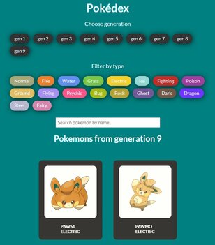

# Pokedex

Pokedex built from [pokeapi.co](https://pokeapi.co/)

The goal of this project is to learn how to fetch data from an API, in this case PokeAPI, and how to deal with that response to display it on HTML page and filter it by different options.

## Technologies used

Built with:

- HTML
- JS
- CSS

## Setup and usage

Live page [here](https://public.bc.fi/s2300103/pokedex)

## Screenshot

## Sources

### README

- [GitHub Guides - masterin markdown](https://guides.github.com/features/mastering-markdown/)
- [Make a README](https://www.makeareadme.com/)

### Pokedex

- Margit Tennosaar (GitHub @margittennosaar): how to get generations from pokemon endpoint, initial help with fetchData and pokeList, hint for searchPokemon

## Authors and acknowledgment

Juli Molnár

- GitHub @julilan
